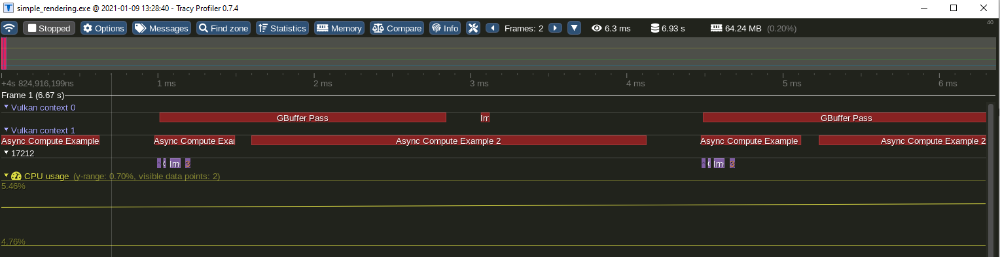
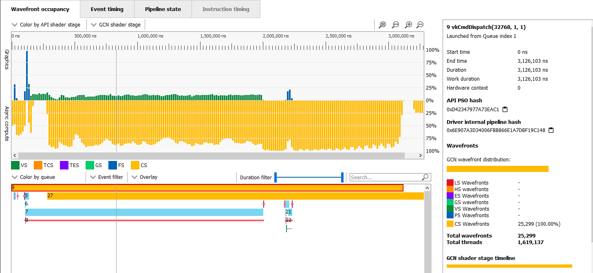
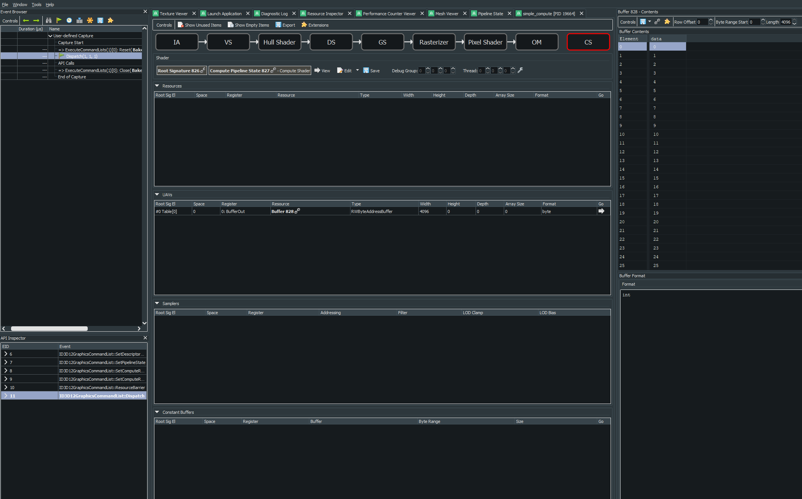
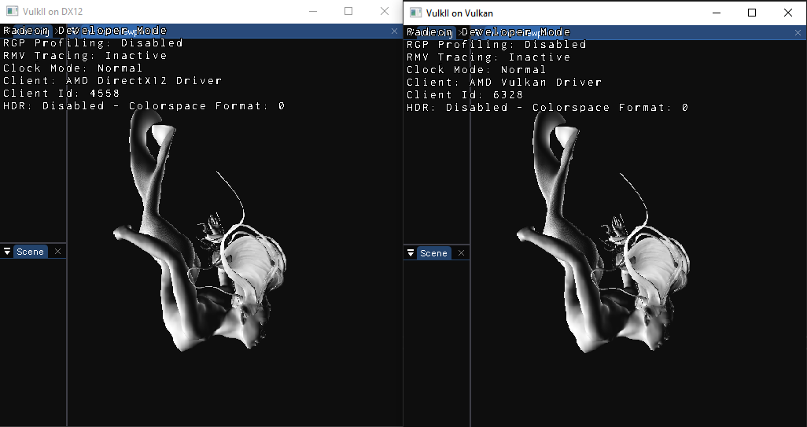

# About
A toy rendering framework for experimentation and fast prototyping. Code is not of production quality, rather, this project is to experiment with approaches and learn the hard way. As of now, it has Vulkan and Dx12 backends.

# Features

1) API is just a convinience layer on top of Vulkan or DX12 with the help of the HLSL compiler.
2) Async compute and copy queues with basic synchronization primitives exposed.





# TODO

1) Ray tracing API.
2) Async memory defragmentation. 

# Optional Dependencies

1) [ISPC](https://github.com/ispc/ispc/releases) in PATH.
2) [embree](https://github.com/embree/embree/releases) in embree_DIR.

# Build

Tested on Windows 10 and Ubuntu 20.

```sh
mkdir build && cd build
cmake ../
```

Example:

```C++
rd::IDevice *dev = rd::create_dx12(NULL);
defer(dev->release());
// Needed to swap command allocators and other per frame contexts.
dev->start_frame();
// Start renderdoc capture
RenderDoc_CTX::start();
rd::ICtx *ctx = dev->start_compute_pass();
// Create signature
Resource_ID signature = [dev] {
    rd::Binding_Table_Create_Info table_info{};
    {
        // set/space 0
        rd::Binding_Space_Create_Info set_info{};
        {
            // 0-binding
            set_info.bindings.push({rd::Binding_t::UAV_BUFFER, 1});
        }
        table_info.spaces.push(set_info);
    }
    // push constants/ root constants size
    table_info.push_constants_size = 4;
    return dev->create_signature(table_info);
}();
// Resource release is deferred so it's safe to release right away.
dev->release_resource(signature);
Resource_ID cs =
        dev->create_compute_pso(signature, dev->create_shader(rd::Stage_t::COMPUTE, stref_s(R"(
[[vk::binding(0, 0)]] RWByteAddressBuffer BufferOut : register(u0, space0);

[numthreads(1024, 1, 1)]
void main(uint3 DTid : SV_DispatchThreadID)
{
    BufferOut.Store<uint>(DTid.x * 4, DTid.x);
}
)"),
                                                              NULL, 0));
ctx->bind_compute(cs);
// Allocate a buffer.
Resource_ID buffer = [dev] {
    rd::Buffer_Create_Info buf_info;
    MEMZERO(buf_info);
    buf_info.memory_type = rd::Memory_Type::GPU_LOCAL;
    buf_info.usage_bits =
        (u32)rd::Buffer_Usage_Bits::USAGE_UAV | (u32)rd::Buffer_Usage_Bits::USAGE_TRANSFER_SRC;
    buf_info.size = sizeof(u32) * 1024;
    return dev->create_buffer(buf_info);
}();
dev->release_resource(buffer);
// Allocate a binding table.
rd::IBinding_Table *table = dev->create_binding_table(signature);
defer(table->release());
table->bind_UAV_buffer(/* set/space= */ 0, /* binding= */ 0, buffer, /* offset= */ 0,
                        /* size= */ sizeof(u32) * 1024);

ctx->bind_table(table);
// Buffer barrier.
ctx->buffer_barrier(buffer, rd::Buffer_Access::UAV);
ctx->dispatch(1, 1, 1);
// End the pass and submit the commands to the queue.
dev->end_compute_pass(ctx);
dev->wait_idle();
RenderDoc_CTX::end();
// Needed to flush deferred resource deallocation.
dev->end_frame();
```

Which results in the following capture:



## Screenshots

